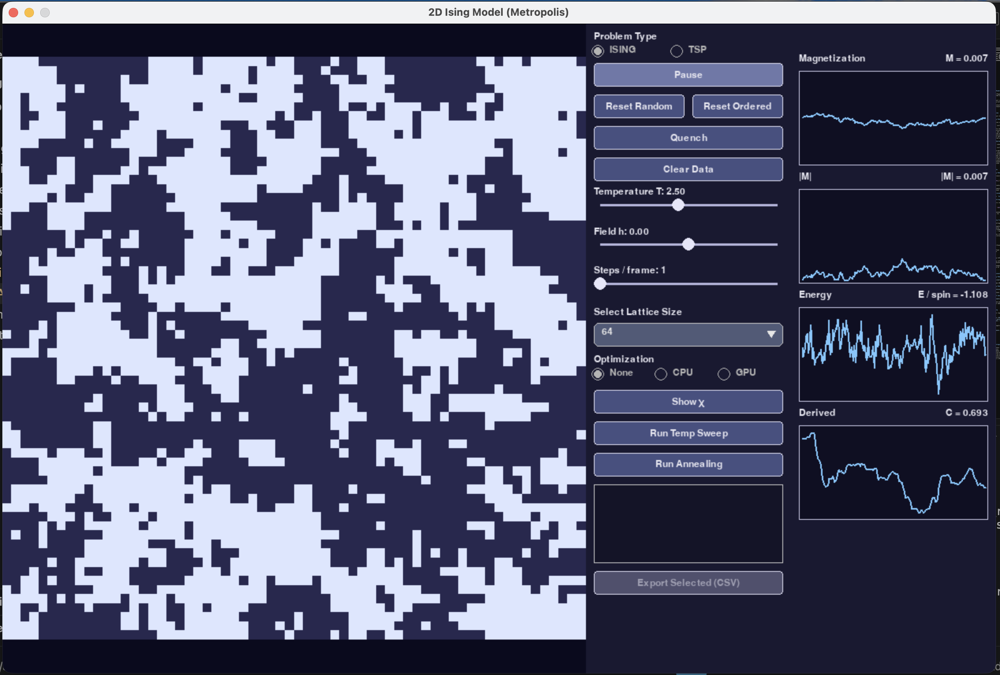
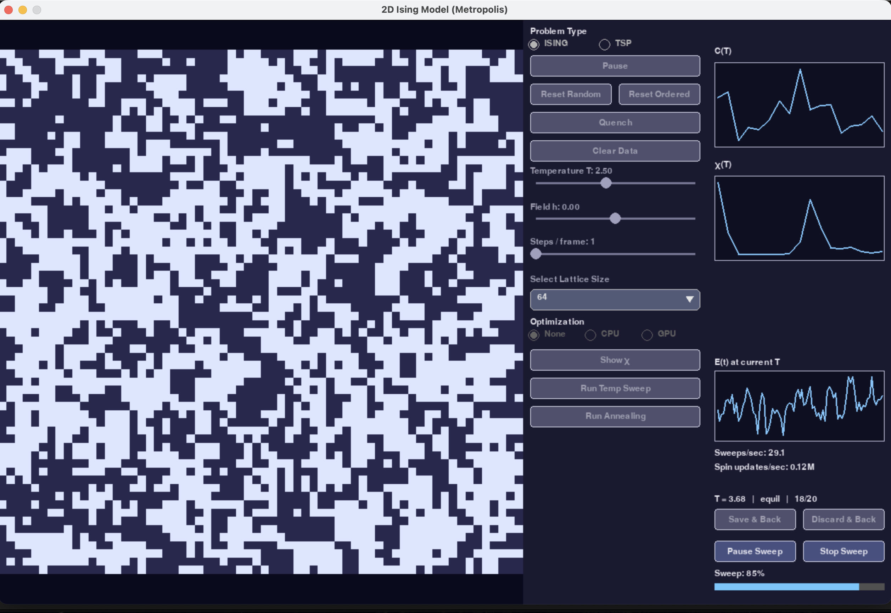
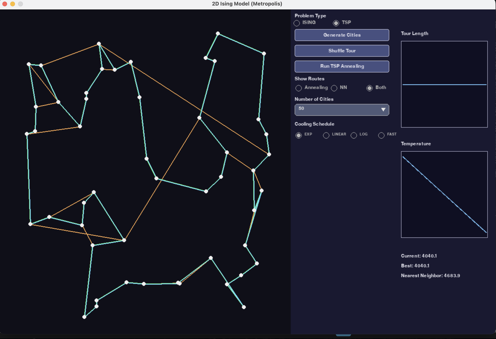

# Ising Model & Simulated Annealing

A Python/Pygame-based interactive simulator for the **2D Ising model**, extended into a general **simulated annealing optimization framework** and applied to the **Traveling Salesman Problem (TSP)**.

The project combines statistical physics, Monte Carlo methods, numerical simulation, and combinatorial optimization in a single interactive GUI.

The architecture is deliberately modular so that additional annealable optimization problems can be added without modifying the core annealing algorithm.

The full project theory report can be found [here](https://drive.google.com/file/d/1GWudGZpCnPTjM9lCVk9KLebU2qATVSbg/view?usp=sharing).

---

## Overview

The project has two unified modes:

### Ising Model

Interactive simulation of a 2D square-lattice Ising model using the **Metropolis algorithm**.

Features include:

* Variable lattice sizes: `32 × 32` through `512 × 512`
* Temperature and external magnetic-field controls
* Random and ordered initial states
* Real-time magnetization, energy, heat capacity, and susceptibility
* Temperature sweeps with live progress and performance statistics
* CPU/GPU optimization backend interface
* Simulated annealing of the spin configuration

### TSP Optimization

The same simulated-annealing framework is applied to the **Traveling Salesman Problem**.

Features include:

* Configurable number of cities
* Random city generation
* 2-opt route proposals
* Euclidean edge weights
* Simulated annealing with configurable cooling schedules
* Nearest-neighbor baseline for comparison
* Visualization of the annealed and baseline routes
* Tour-length and temperature plots
* Comparison of current, best-found, and nearest-neighbor tour costs

---

## Methods

### Ising Model

The simulator implements single-spin Metropolis updates for the Hamiltonian

$$
H = -J\sum_{\langle i,j\rangle}s_i s_j - h\sum_i s_i
$$

with periodic boundary conditions.

Thermodynamic observables are estimated from the simulation history, including magnetization, energy, heat capacity, and magnetic susceptibility.

### Simulated Annealing

A generic `SimulatedAnnealer` operates on an abstract annealable problem.

### Traveling Salesman Problem

Cities are represented as points in the 2D GUI canvas. Edge weights are Euclidean distances:

$$
d_{ij} = \sqrt{(x_i-x_j)^2+(y_i-y_j)^2}
$$

The TSP annealer uses **2-opt moves**, while a nearest-neighbor construction provides a simple baseline for evaluating the resulting tour.

---

## Cooling Schedules

TSP annealing supports multiple cooling schedules:

* **Exponential**
* **Linear**
* **Logarithmic**
* **Fast / Cauchy**

This makes it possible to experimentally compare how the cooling schedule affects convergence and final solution quality.

---

## GUI

The interface is organized around a common problem selector:

```text
Problem Type
(•) ISING
( ) TSP
```

Selecting **Ising** exposes the lattice simulator and thermodynamic controls.

Selecting **TSP** replaces the lattice visualization with a city/route visualization and exposes the optimization controls.

The two modes share the underlying application infrastructure while keeping their problem-specific state and UI separate.

---

## Screenshots

### Ising Model — Interactive Simulation



*Real-time 2D Ising simulation with lattice, controls, and thermodynamic observables.*

### Ising Model — Temperature Sweep



*Temperature sweep with live energy trace, progress information, and performance statistics.*

### TSP — Annealing



*Simulated annealing applied to the Traveling Salesman Problem, with the annealed route (green) overlaid on a nearest-neighbor baseline (orange).*

---

## Running

Clone the repository and install the required Python dependencies:

```bash
git clone https://github.com/kcsaswade/ising_project
cd ising_project
pip install -r requirements.txt
```

Run the application with:

```bash
python3 main.py
```

---

## Technologies

* **Python**
* **NumPy**
* **Pygame**
* Monte Carlo / Metropolis methods
* Simulated annealing
* Numerical/statistical analysis
* Combinatorial optimization
* In-built GPU acceleration infrastructure

---